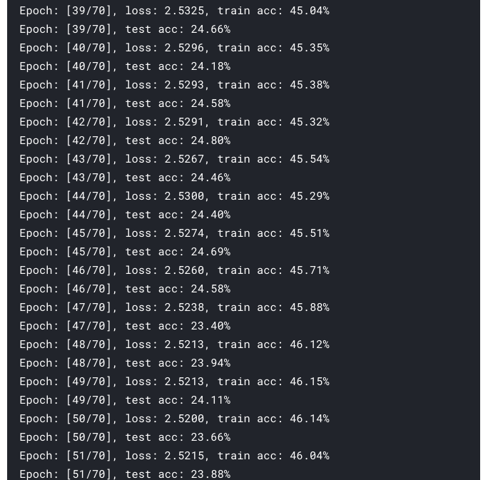
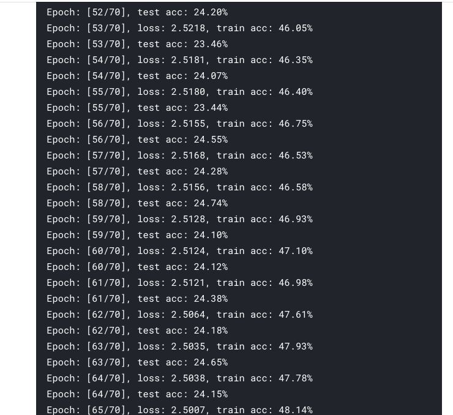

# Human Activity Detection
  I have tried both LSTM and CNN on the preprocessed data but after a little bit of research and after trying also, I found CNN better. I have also tried to fit Logistic Regression model. It also underperfomed.
  
  Here are details about different files in the repo:;
  1. ```prithvi.ipynb``` - This contain all the code for preprocessing training and testing.
  2. ```prithvi_cnn.pth``` - The trained CNN model.
  3. ```logistics.sav``` - The trained logistics regression model.
  4. ```results.csv``` - CSV file containg results.
 
  I have trained this network on Kaggle. Here is the link to Kaggle Notebook: [Kaggle Notebook](https://www.kaggle.com/adityakumar01/prithvi). You can see the results in the kaggle as well as the repo notebook.
  The screenshots for the results are:
   
